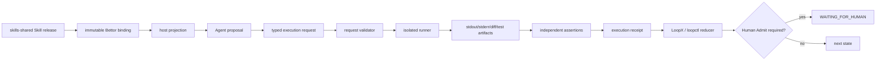

# Executable Skill and assertion contract

Owner: [`harness-wiki`](../SKILL.md). This module separates procedural generalization in `SKILL.md` from code execution, assertion evaluation, and LoopX/`loopctl` state transitions.

## Core law

```text
SKILL.md proposes a procedure
Agent proposes an execution request
host-owned runner executes an argv vector in a bounded sandbox
independent assertion engine observes artifacts
LoopX / loopctl alone commits state
Human alone admits promotion where policy requires it
```

A Markdown sentence such as “run the tests and confirm they pass” is a soft instruction. A script bundled in a Skill improves repeatability, but it is still not proof until a trusted runner actually executes the pinned script against the pinned subject and an independent gate records the result.

## Three-plane design

### 1. Instruction plane

Owned by `skills-shared`:

```text
SKILL.md
references/
scripts/                 # reusable implementation, not an automatic authority
assets/
evals / tests
```

A Skill should encode:

- trigger and non-trigger conditions;
- preconditions and capability requirements;
- deterministic procedure;
- expected artifacts;
- failure and rollback behavior;
- which assertions are hard versus advisory;
- handoff conditions;
- relative paths only.

### 2. Execution plane

Owned by Bettor/LoopX/runtime bindings. The Agent submits `skill-execution-request/v1`, not a raw shell string.

Required properties:

- exact repository commit/tree and Skill digest;
- one executable plus `argv[]`;
- repository-relative `cwd`;
- closed or explicitly sourced stdin;
- environment-name allowlist, never secret values;
- timeout, output, process-group, network and writable-path limits;
- referenced assertion-set identity;
- declared expected artifacts and cleanup policy.

Forbidden:

- `shell: true`;
- `bash -c` or equivalent unreviewed command interpolation;
- an arbitrary command string generated by the model;
- absolute host paths or `..` traversal;
- implicit current branch as durable identity;
- worker write access to LoopX state, gate verdicts or Human decisions.

### 3. Assertion and state plane

The assertion engine evaluates `skill-assertion-set/v1` after execution and writes `skill-execution-receipt/v1`.

Supported hard assertion classes:

| Type | Oracle |
|---|---|
| `exit_code` | OS-observed process exit code |
| `stdout_json_schema` | parser/schema result for captured stdout artifact |
| `stderr_pattern` | bounded diagnostic pattern |
| `file_exists` | sandbox path and file type |
| `file_hash` | content digest |
| `file_content` | exact/regex/structured content check |
| `git_diff_allowlist` | changed paths and operation classes |
| `ast_query` | deterministic structural matcher |
| `lsp_diagnostics` | language-server diagnostics with declared workspace/coverage |
| `test_report` | JUnit/TAP/declared test artifact, not model prose |
| `artifact_digest` | content-addressed output identity |
| `subject_match` | receipt subject equals requested repository/commit/context/Skill |

Model review, LLM-as-a-judge and Human comments may be `advisory`; they cannot substitute for an available deterministic oracle. A semantic judge may block or request review, but it does not rewrite a failed OS/test assertion into PASS.

## State model

```text
NOT_RUN
  ├── ABSENT
  ├── NOT_EXERCISED
  ├── SKIPPED_BY_POLICY
  └── RUNNING
        ├── PASS
        ├── FAIL
        └── ERROR
```

Receipt rules:

- `PASS` requires `executed=true`, an observed integer exit code, subject match, evidence digests, and every hard assertion `PASS`.
- `NOT_EXERCISED` requires `executed=false` and cannot carry a successful assertion result.
- Provider absence, Skill discovery, compilation of the verifier, or a model's statement is not execution PASS.
- Unknown coverage remains `UNKNOWN` inside the assertion evidence and normally prevents an absence claim.
- Cleanup failure cannot be hidden by test success.

Bettor CLI exit convention remains:

```text
0  requested deterministic operation succeeded
2  operation ran and the checked subject failed
64 usage error, missing required dependency, or invalid request
```

## Data flow



## Portable script rule

Bundled scripts should:

- accept explicit arguments and return meaningful exit codes;
- avoid hidden network or host-state assumptions;
- support a machine-readable output mode where useful;
- write only declared artifacts;
- be idempotent or declare non-idempotency;
- make dependencies and version requirements explicit;
- include positive, hollow and mutation controls;
- never directly mutate LoopX state or emit a self-authorized PASS receipt.

## Local contract checks

```bash
python3 .agents/skills/harness-wiki/scripts/check_portable_execution_contract.py --selftest
python3 .agents/skills/harness-wiki/scripts/check_portable_execution_contract.py \
  --root .agents/skills/harness-wiki/tests/fixtures/good
```

These checks validate the contract shape and planted negatives. They do not execute Codex, Claude Code, Grok Build, OpenCode, Pi, Ante, Serena, GrepAI, Code-Graph-RAG, Mem0, or a production sandbox. Exact host/runtime canaries remain `NOT_EXERCISED` until subject-bound receipts exist.
