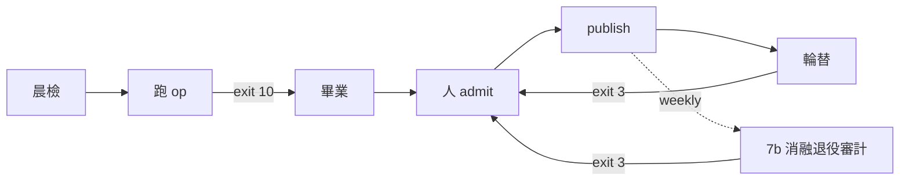

# Skill: product-ops — 按產品規格驅動工廠(大迴圈營運 runbook)

> **Role**:大迴圈(主 session,Fable)的營運入口
> ——把 `PRODUCT.md`(產品 SSOT)與 `ARCHITECTURE.md` §9
> 每日管線變成可執行的 runbook。
> 每步綁真實指令與真檔案;
> 執行型態的 know-why 與效益帳在
> [modules/ops-know-why.md](modules/ops-know-why.md)。
>
> **鐵律**:本 skill 只執行,不重定義產品紅線(PRODUCT.md)
> 與工程規範(loop-harness-standard)——重抄=雙圖漂移。
> 人閘清單=ARCHITECTURE.md §8,
> 機械層以下全自動、閘上永遠 SURFACE 交人。

## When to Use
- 開一個工作 session,要知道「今天這座工廠該做什麼」(晨檢→選題→跑 op→發佈)。
- 一條演化 op T0 綠了(engine exit 10),要走畢業段與 publish。
- 輪替工具 SURFACE 了到期案例,要走輪替流程。

## 確定性程序



### 1. 晨檢(每 session 開工,~2 分鐘)
```bash
git -C {REPO_ROOT} status --short && git log --oneline -3   # 乾淨才開工
loop_wiki/_template/selftest.sh                                          # 判分器活著(mock,30 秒)
python3 families/pinescript-audit/evals/check_rotation.py --as-of <今日> # exit 3=有輪替人閘
python3 scripts/check_all_skills.py                                      # 一鍵防禦形態(repo 級閘+泛型串聯每個 family)
```
(`check_all_skills.py`=agent-skills-repo 終極防禦形態統一入口:repo 級 skill 層閘
(conformance/card_sync/ssot_index)+泛型發現每個有 evals/cases 的 family 串聯共享
eval 閘(case_baseline 等)。防禦閘=repo 級共享 `scripts/`,domain 靠 --family 串聯,
不埋在某 family。)
068af77/bab2d2a 新接常設閘:family 層除 case_baseline 外再串 check_difficulty_gate(D4 難度稀釋)、
check_dist_safety(D6);另加一組 SKILL.md 品質/安全 linter——check_leak_inline(P12 憑證常量 FAIL)、
check_fluff(P8 無錨廢話 FAIL)、check_goal_oriented(P9 順序詞 WARN-only 不擋)。皆同屬下句「非綠先修再開工」範圍。
skill 層 evals/tests 每日綁定閘(所有 skill 遵守;契約=skill-authoring「統一 eval/test 契約」節):
conformance(官方 name/desc/body 硬約束)+card_sync(名片同步);非綠先修再開工。
再讀:各家族 `changelog/` 最新條(昨日做了什麼)+`FAMILY.yaml` metrics(雙軌現值)。

### 2. 選題(產能分配)
優先序:
- ① 家族 changelog「已知問題/行動項」
- ② `proposals/` 已過可執行驗證者
  (status=verified;其「變現行動候選」節=現成 op 題)
- ③ 下注訊號
  (MVP 期=人工挑題,佇列=`proposals/QUEUE.md`)

每題轉成**一個 op**(spawn/refine/prune/spawn-cases),
判定式先落 PROMPT.md。

供給側:QUEUE 有 pending 且無 verified proposal 可用
→ 今日排一題 DR 批次(§3b)。

**心跳供給硬約束**(PRODUCT.md 心跳敘事):
每 14 天心跳須 ≥1 批 candidates 在服役中——
選題時先查 `registry.json`,
服役批將輪替出清而無新批接棒=優先排 spawn-cases op。

### 3. 跑 op(工程規範=loop-harness-standard,本節只列調用)
```bash
cp -r loop_wiki/_template loop_wiki/<op-slug>   # 填 PROMPT/CLAUDE;作者先 ls anti/ 讀前科
git worktree add .claude/worktrees/<op-slug> -b evolve/<op-slug>   # 隔離,主 tree 不動
loop_wiki/engine.sh <op-slug> --target <path> [--driver claude|agy|subagent]
```
tier:author=Sonnet(播錯設計=Opus);
exit 10=候選、21/20=stop-loss SURFACE、22=driver 異常。

### 3b. 跑 DR 批次(每日 06:30 research 段;完整程序=dr-research-loop skill,本節只列調用)
```bash
cp -r loop_wiki/_template_dr loop_wiki/dr-<topic>   # 填 PROMPT Op 節;stub 落 proposals/(14 維全缺口)
loop_wiki/engine.sh dr-<topic> --target <proposal 絕對路徑> --driver agy --max-iters 4
# exit 10(T0 四閘綠)→ D3 審查(fresh Opus,findings-only)→ 人裁:admit/feedback 輪/reject
bash loop_wiki/dr-<topic>/run.sh agy <target> <findings 檔>   # feedback 輪=run.sh 單發
#   (engine 對已綠 target 走 conform_only 短路不 dispatch,修正輪不走 engine)+重跑 verify.sh
```
高承重題(直餵 PRODUCT 決策/綁家族)選配**三池鏈路**:
- Stage 1 訂閱池瀏覽器 DR 鋪廣度
  (raw=UNTRUSTED 落沙盒 logs/,禁當錨)
- → agy 只燒合約化
- → D3+external-verify(數字類不讓 agy 自查)
- → 人 admit

機制/失敗模式/判活紀律=dr-research-loop
`modules/three-pool-pipeline.md`,本節不重抄。

admit 動作:
- proposal status→verified
- `QUEUE.md` 標 completed
  (誠實收尾:completed ⇔ 真有 T0 綠 proposal)
- 沙盒 PLAN→done
- 7 天內轉家族/轉 op,逾期歸檔 `proposals/archive/`

**消化段(admit 後,人核)**:
proposal 訊號 → `PRODUCT.md` 手術級 delta
(帶日期+指針錨,一句一錨,研究本體留 proposal 不重抄;
先例=2c8f3be/3a82cfe);
綁家族者過 D3+人核可即走 adopted
(`git mv → families/<f>/proposals/`,root 不留副本;
首例=pinescript-quant,3a82cfe)。

### 4. 畢業段(T0 綠之後,大迴圈執行)
- holdout **只跑一次**:
  `runner.py --set holdout --compare evals/baselines/<最新 sonnet-holdout>.json`
- trigger evals(G4;接 runner 前=人工核)
  + Opus fresh 判官(禁 fork,findings-only)
- 新案例型 op 加語意鑑別坐實:
  方法=loop-harness-standard
  `modules/evals-design-method.md` §4,
  工具=家族 `evals/candidates/_validation/*/tools/`(唯讀 dispatch)

### 5. 人 admit(唯一決策點;引 ARCHITECTURE.md §8,不重列)
merge/輪替/spawn 新家族/對外發佈——G 閘全綠=候選資格,不是 merge 令。

### 6. publish(每次 merge 後,一次做完)
- `FAMILY.yaml`:回填雙軌 metrics+history dated 條目
- `evals/baselines/`:快照檔名帶量尺
  (如 `YYYY-MM-DD-sonnet-public.json`);量尺=Sonnet 釘死,
  換量尺=重落基線+舊檔退役註記
- 家族 `changelog/YYYY-MM-DD.md`:
  加了什麼/**刪了什麼**/分數變化+「已解/禁回退」錨
  (這就是訂閱者看到的產品更新)
- git commit(訊息寫 why)——這一刻之前迭代禁 commit

### 7. 輪替(check_rotation exit 3 觸發;admit 人)
輪替前:runs=3 重驗+啟用 `--judge-cmd`(fix-quality 進分母)
+量測 semantic_pass_rate 回填;
admit 後:案例搬移+registry.json 狀態更新+最老 public 案例退役歸檔。

### 7b. 消融退役審計(頻率候選:weekly,▣;人手動觸發;exit 3 觸發;admit 人)
跨 family 驅動器(on-demand,人主動起才跑——絕無 cron/排程/hook,每跑 real 燒 LLM):
`scripts/ablation_audit.sh --as-of <today> [--probe|--real "<釘死 model 的 agent-cmd>"]`
(delegate=`scripts/check_ablation_retirement.py`,2026-07-20 已搬出 family 到 `scripts/`;
舊 `for f in families/*/…evals/check_ablation_retirement.py` 迴圈路徑已失效,勿用)。
- `--probe`(預設):mock 雙臂**接線健檢**,零真 LLM。⚠ 只證鏈路通,**非退役裁決**
  (寬鬆 status 不可外洩進退役證據鏈);
- `--real "<cmd>"`:人顯式傳釘死 model 才真燒;缺 cmd→fail-fast(絕不 fallback DEFAULT sonnet)。
驅動器逐 family 收 exit(不吞 stderr)+印**彙總 delta 表**;聚合 exit 鏡像 delegate 語意
(任一 2→2、否則任一 3→3、否則 0——exit 3 機械可偵測,靜默吞例外違全局鐵律)。
每次 real 審計前驅動器先印呼叫數估算(每 family:2臂 × trials × 已畢業子技能數 次真 agent);
硬上限(成本閘)候選待實作,▣。先估再跑,不可略過直接上線。
exit 3(有退役候選,findings 非狀態檔)→ 人 admit:
退役動作=搬 `families/<f>/skills/_retired/`(2026-07-20 人裁定案:保留可回溯可復活,
非直接刪;changelog 同記退役帳+分數證據)——**產報告人 admit,非自動退役**。
exit 0 含「無已畢業子技能」WARN 跳過,
屬正常現況(非審計型家族或家族尚無 stable/encapsulated 子技能),不算異常。

### 7c. no-ops 行級剪枝(姊妹 on-demand 工具;人主動起才跑;admit 人)
`scripts/purge_loop.py`(絕對路徑)=與 §7b 消融審計並列的另一支 on-demand 昂貴工具:
逐行試刪 SKILL.md→跑該家族 eval→通過率不退則採納刪除、退了 rollback,燒 LLM。
與 `check_ablation_retirement` 分工=整-skill 退役 delta(該 skill 該不該退役)
vs 本檔行級 no-ops 剪枝(skill 內哪些行零貢獻),非重複組件。
絕不自動改原檔——只出建議版(`--out` 落新檔或印 stdout),人 admit 才寫回;
`--selftest`(dummy skill+mock eval)/`--dry-run`(列行清單/成本預估)不燒 LLM。

## 執行型態(tier-dispatch 實戰,2026-07-11 實證;why 見 modules)
- **長時 runner(>10 分鐘)**:
  拆 per-case/per-arm 背景任務,禁單一長 Bash(10 分鐘牆)。
- **多 arm fan-out**:
  Haiku 機械 subagent 各管一 arm(只回原始資料禁解讀);
  裁決=Opus fresh。
- **agy**:複核=唯讀 dispatch;
  DR 批次=寫入面只限 target+自己沙盒(絕不含 families/)。
  判活看輸出檔 diff 非 exit code;
  **driver 自記帳(沙盒 PLAN)不可信,誠實帳=engine
  `_engine-run/trajectory.log`**
  (2026-07-11 實證:agy 自記 PROGRESS 超出口徑上限)。
- **三池額度分工**(2026-07-11/12 四題實證):
  訂閱池(瀏覽器 DR)燒廣度、agy 池只燒合約化、
  Claude 池只買獨立性(D3/external-verify)
  ——兩個 Gemini 面+agy=同權重,互查**不疊加獨立性**;
  帳與 why 見 dr-research-loop
  `modules/three-pool-pipeline.md`。

## 營運對映表(runbook 步驟 → 執行組件 → 規範 SSOT → 故障先看哪;零複製,只 cross-reference)

| 步 | 執行組件(真檔案) | 規範 SSOT | 故障先看 |
|---|---|---|---|
| §1 晨檢 | `_template/selftest.sh`+`check_rotation.py` | evals-design-method(正控)/ARCHITECTURE §8 | selftest FAIL=判分器死→家族 runner/judge;rotation exit 2=registry 漂移,先修表再談輪替 |
| §2 選題 | 家族 `changelog/`+root `proposals/` | PRODUCT.md 訊號優先序/鐵律 1 知識單向流 | proposals 未過可執行驗證就想入 op → 擋 |
| §3 跑 op | `loop_wiki/engine.sh`+沙盒 run/verify | loop-harness-standard(基座卡+鐵律) | exit 21/20→`_engine-run/trajectory.log`+沙盒 `anti/`;22→`driver.iterN.out`;64→契約檔缺失 |
| §3b DR 批次 | `_template_dr` 四閘+`engine.sh`+D3 subagent | dr-research-loop(程序)+`proposals/README.md`(schema=判定式) | 死鏈/授權 FAIL→verify 輸出逐條;agy 疑 no-op→diff target;D3 抓虛構→feedback 輪 |
| §4 畢業 | `runner.py --set holdout --compare`+`_validation/*/tools/` | evals-design-method §4/harness-wiki 不變量 4·6 | holdout 分數異常→先查量尺同不同 model(基線 JSON 的 agent_cmd 欄) |
| §6 publish | `FAMILY.yaml`+`baselines/`+`changelog/` | PRODUCT.md 證據鏈;動 `.claude/skills/` 才走 skill-authoring | 曲線跳點→查是否跨量尺混畫 |
| §7 輪替 | `check_rotation.py`+`registry.json` | evals-design-method §4 產品化(semantic_pass_rate) | 漂移(exit 2)優先於到期(exit 3) |

(§5 人 admit 無執行組件——它就是人;清單=ARCHITECTURE §8。)

## Gotchas
- 產品紅線在 `PRODUCT.md`(點數不現金/集中批次/量尺紀律/雙軌證據)——操作衝突時以它為準。
- **DR 迴圈的產品價值在「攔錯誤戰略結論」不在產漂亮報告**:負面情報(紅海證偽/定價封頂)
  同樣 admit 入帳;「空位/藍海」型漂亮敘事反而是 D3 的最高強度證偽對象(pinescript 案,
  0bbb26a——初稿藍海結論被推翻,反證就在 producer 自己棄用的來源清單裡)。
- 晨檢發現主 tree 髒=上個 session 沒收尾,先處理再開新 op(禁帶髒開工)。
- 曲線只認同量尺分數:跨量尺畫同一條線=造假,PRODUCT.md 明文禁止。
- **別幫大迴圈「補完」八大基座沙盒**——大迴圈刻意不沙盒化,why 見
  [modules/ops-know-why.md](modules/ops-know-why.md) §6。

## Modules
- [modules/ops-know-why.md](modules/ops-know-why.md)
  — 效益疊加帳(各機制值多少)、tier 成本結構實測、
  為何雙軌/為何人閘不可自動化(產品信任本體)。
