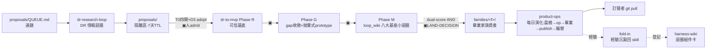
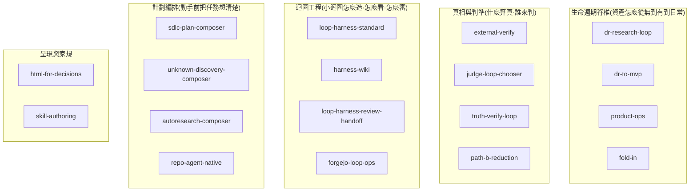

# Skill 全景圖(homed 2026-07-20;源計劃=docs/plans/2026-07-20-skill-spec-decompression/)

> **LEGACY REFERENCE**：這是舊 skill-bettor 資產工場的歷史 topology，不是目前 bettor-arena discovery catalog。現況以 `.agents/skills/`、`harness-wiki` 與 generated module catalog 為準；本檔只保留語意追溯，不再 additive 更新。

> **紀律**:本圖=人面投影,只放「名稱+一句人話+關係」,禁抄任何 skill 內部程序
> (抄=雙圖漂移,同 harness-wiki 鐵律)。事實漂移以各 SKILL.md 為準。
> **再生觸發**:新 skill 落地/退場/職責變更時 additive 更新本圖(同 harness-wiki 組件卡慣例)。

## 一、一句話定位:這座工廠在做什麼

skill-bettor 是 **living-skills 資產工場**:
把「外部情報」煉成「可賣的家族 skill 資產」(`families/`),
用 eval 閘守質量,訂閱者拉取成長中的資產。
`.claude/skills/` 的工程 skill = 工廠的**操作手冊**,不是商品。

## 二、業務主流程(資產的一生)



▣ = 人閘(永遠人 admit,無 auto-chain)。
知識單向流:proposals → 驗證 → 沙盒 → eval 閘 → 人 admit → merge,沒有旁門。
外部品質座標系(SkillBench 生態)錨在 **M 的 eval 閘**與 **OPS 的 publish 段**兩節點,見第六節。

## 三、工程 skill 分五組(業務職能)



## 四、每 skill 名片(一句人話+上下游;細節看各自 SKILL.md)

### 生命週期脊椎
| skill | 一句人話 | 上游(誰餵它) | 下游(它餵誰) |
|---|---|---|---|
| dr-research-loop | 把一題市場情報跑成過閘的 proposal | QUEUE.md 選題 | proposals/ → dr-to-mvp Phase R |
| dr-to-mvp | 冷啟動脊椎:研究題→可信基底→prototype→畢業家族資產 | proposals/ 已驗基底 | families/ 新家族 → product-ops 接手 |
| product-ops | 既有家族的每日運轉 runbook | 畢業家族 | publish 給訂閱者;經驗給 fold-in |
| fold-in | 把做完的經驗沉回既有 skill,不亂造新 skill | 任何完成的工作 | 各 owner skill;迴圈類回 harness-wiki 登記 |

### 真相與判準
| skill | 一句人話 | 何時輪到它 |
|---|---|---|
| external-verify | post-cutoff/無 URL 的「官方規範」claim,查 primary source 拿鐵錨 | 任何拿不出錨的自信 claim |
| gemini-conversation-research | 把 Gemini 對話 URL/上下文 Q&A 轉成保真知識缺口、引導按鈕 trace、DR 補缺與小迴圈 seed | 有 Gemini 對話 URL、contextual suggestion buttons、或 GCR 對話要進計劃包時 |
| judge-loop-chooser | 一個 deliverable 該用什麼驗證標準+獨立性 tier | 每次收斂/畢業/proposal 裁定前 |
| truth-verify-loop | 一批 claims 的多 tier 逐字驗證閉環(引擎未本地實例化) | 重大文章/概念集要整批驗真時 |
| path-b-reduction | 把「平均/提升/優化」類平滑敘事約分回確定性鐵錨 | 寫作/評估出現無錨敘事時 |

### 迴圈工程
| skill | 一句人話 | 分工邊界 |
|---|---|---|
| loop-harness-standard | 造新小迴圈的工程規範(八大基座) | 定義「怎麼造」 |
| harness-wiki | 已有迴圈的全景地圖(組件卡+不變量) | 記錄「長怎樣」;改迴圈前必查 |
| loop-harness-review-handoff | 把 harness 架構審計交給 fresh session 獨立 reviewer | 要獨立審計/優化整個 harness 時 |
| repo-wiki-converge | 把 repo 源碼和 openwiki/wiki 產物收斂成可驗證使用入口 | 需要 repo 可用性地圖、openwiki 接線、RepoDoc ingest 遷移時 |
| forgejo-loop-ops | 把大迴圈的工作投影成一個本機 Forgejo 小迴圈，並把 repo 寫入交給 repo-local operator | 既有 Chrome 登入、issue／PR／merge、Git 交接或 Forgejo 降級恢復時 |

2026-07-22 fold-in:production-ready seed loop 的**通用方法**歸
`loop-harness-standard/modules/production-seed-loop.md`;已落地迴圈、資料流歸屬、prompt/context
owner registry 與判斷邏輯歸 `harness-wiki/SKILL.md` +
`harness-wiki/modules/prompt-registry.md`。本全景圖只登記關係,不複製 prompt 或 packet schema。
2026-08-03 新增 bounded repo-factory worked candidate：四類 physical intake → standalone repo＋
repo-local operator skill＋20-call DAG；仍由同一 production-seed 方法與 harness-wiki component card
管理，不另造全域工程 skill。

### 計劃編排
| skill | 一句人話 | 何時輪到它 |
|---|---|---|
| sdlc-plan-composer | 多階段任務的 stateful 計劃路由器(M/G/V 節點+route-ledger) | 要先計劃再動手且需路由/組合/驗證契約時 |
| unknown-discovery-composer | 需求還在霧裡:未知盤點+路由到對的 skill | 不知道該問什麼時(最上游) |
| autoresearch-composer | 「對某指標有界迭代」類計劃切片的編排 | 計劃裡有優化迴圈時 |
| repo-agent-native | 從既有 code repo 抽 source-anchored 不變量 | brownfield 動工前的自動盤點 |

### 呈現與家規
| skill | 一句人話 | 何時輪到它 |
|---|---|---|
| html-for-decisions | 人閘節點的 HTML 決策面+理解 quiz | 五類 LAND-DECISION 人閘 |
| skill-authoring | 本 repo 的 skill 設計家規(兩類分界+語意真相/stateful workflow) | 新建/重構任何 skill 前 |

## 五、典型一天的路由(從任務找 skill)

```text
「今天工廠該做什麼」──────────────→ product-ops(晨檢)
「有個模糊的新想法」──────────────→ unknown-discovery-composer → sdlc-plan-composer
「要研究一個市場題目」────────────→ dr-research-loop
「研究要長成新家族」──────────────→ dr-to-mvp
「這個 claim 是真的嗎」──────────→ external-verify(單條)/truth-verify-loop(整批)
「這個產物過不過」────────────────→ judge-loop-chooser
「要建/改一條小迴圈」────────────→ 先 harness-wiki(查圖)→ loop-harness-standard(造)
「要讓大小迴圈操作本機 Forgejo」──→ forgejo-loop-ops → repo-local operator
「做完了,經驗放哪」──────────────→ fold-in
「要新建/重構一支 skill」────────→ skill-authoring
```

## 六、外部標準對照(SkillBench 生態;僅收 2026-07-20 external-verify 已驗項)

**定位**:SkillBench/SkillsBench=**外部品質座標系**。被它量的是 `families/` 商品
(對外分發、會被第三方評分的資產),不是 `.claude/skills/` 工程層(自用工具)。
座標系錨在主流程兩個節點:**eval 閘**(paired evaluation 同構)與 **publish 人閘**
(分發前品質/安全維度)。查證錨與逐字引文 → external-verify/modules/verified-truth.md。

| 外部標準(已驗) | 我方對應機制 | 對齊狀態 |
|---|---|---|
| SkillsBench paired evaluation(同 agent 有/無 skill 對照) | families evals runner.py 的有/無 skill 對照;成長曲線原點 +41.7pp(2026-07-11,先於該論文) | ✅ 已對齊 |
| SkillsBench「≤3 modules 優於大包」 | families 路由器+子技能 <500 行結構契約 | ✅ 大致對齊;工程層個別 skill 附檔數待審(如 loop-harness-standard 14 個) |
| SWE-Skills-Bench「49 支 39 支零提升」 | 「無 eval 證明提升的 skill 預設無效」= 本 repo eval 閘哲學 | ✅ 外部佐證我方賣點(可引入 PRODUCT.md,▣人裁) |
| Arcade Tool Boundary 25%(skill 傳 SOP、tool 執行) | checklist 7:確定性邏輯必落 load-bearing 腳本,skill 只指向 | ✅ 已對齊 |
| Arcade Workflow Quality 12%(no-op 膨脹) | husk 禁令(無鐵錨散文不收)+tight 紀律 | ✅ 已對齊 |
| Arcade Discoverability 8% | description pushy 條款+trigger-evals 正交性檢查 | ✅ 已對齊 |
| Arcade Provenance 10% | git+changelog/+FAMILY.yaml+baselines/ | ✅ 已對齊 |
| **Arcade Safety 35%(最高權重)** | **無對應——真 gap**:安全自查缺位;第一層 authoring 機械自查已落:check_leak_inline(P12 .claude/skills 憑證常量)+check_dist_safety(families 憑證/隱藏unicode注入/未宣告外呼),068af77;broader harmful-action/權限半徑 safety 仍開,第二層 publish 閘待 | 🟡 partial;**雙層左移**:第一層 authoring 家規自查+第二層 publish 閘(PLAN S2/S4,▣) |
| Arcade Portability 10% | 單 host 現況(Claude-Code-only) | ⏸ deferred 至 AGENTS.md 雙軌日 |
| SkillFlow 檢索(~36K SKILL.md corpus) | rag-local skill_match/skill_load(本地既有) | ✅ 機制同構 |
| Arcade Deploy 託管執行(IP 護城河) | families 現況=訂閱者 git pull 明文;「宣告式接口+外部化執行」是設計選項非既成業界事實 | ⏸ 未裁;變現架構題,歸 dr-research-loop 正門 |

**不收的**(查證為幻覺,永不入圖):Microsoft 63,000 開發者部署、DeepMind 評估
50,000 技能/no-op 分析。依賴這兩條的一切推論作廢。

### 6b. 治理機制對照(gcr 語料;機制候選非實證,完整映射表 → PLAN.md §1b)

來源=antigravity gcr「Skills Need Evals, Don't Ship Blindly」對話萃取
(語料自帶誠實旗標:數字全模擬,只收機制)。核心立場=**安全與品質左移到
authoring**,出廠閘是第二層。已對齊 6 項(消融對照/舊測試集防刷分/Regex 100%/
宣告式約束/三層漸進揭露/husk 哲學);真 gap 2 項:
- **週期消融退役審計**(skill 增益被新 model 原生覆蓋→自動提退役)——
  PRODUCT.md 有 prune 概念無機械執行;候選進 product-ops 輪替段(▣)。
  (2026-07-21 落地:scripts/ablation_audit.sh on-demand findings-only + purge_loop.py
  建議版人 admit,f261c2b;仍非週期/cron 自動退役)
- **機械化 fluff/安全自查**——husk 禁令與安全條款(2026-07-21 落地為 check_all_skills
  常設 T0:check_fluff P8 FAIL + check_leak_inline P12 憑證安全自查,068af77;PLAN S2 此格已交付)。

## 七、與 harness-wiki 的分工

harness-wiki = **迴圈層**全景(現有迴圈的資料流+收斂閘+不變量;數量以 harness-wiki 組件卡為準)。
本圖 = **skill 層**全景(工程 skill 的業務職能+路由;數量以實際 `.claude/skills/*/SKILL.md` 為準)。
互指針不重疊;迴圈細節永遠以 harness-wiki 為準。
production seed loop 的 prompt/context/dataflow 判斷 owner 也以 harness-wiki 的 prompt registry 為準。
