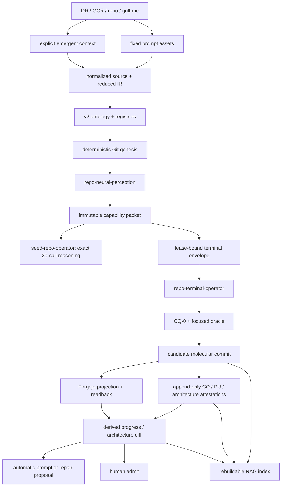

# Perfect-seed v2 execution plan

This is the canonical, machine-readable execution plan for evolving the bounded
factory from `perfect-seed-repo@1.1.0` to a standalone
`perfect-seed-repo@2.0.0`. It is a plan, not implementation evidence. Creating
this directory does not advance any milestone.

The location intentionally follows the human-approved factory-local boundary
instead of the generic `docs/plans/<date>-<topic>/` convention. There is one
SSOT: this directory. Do not mirror mutable plan definitions elsewhere.

## Truth layers

1. `plan-registry.json`, `intended-architecture.json`, and
   `oracle-registry.json` are normative definitions.
2. Git commits, content-addressed receipts, append-only attestation refs, and
   Forgejo readbacks are physical facts.
3. `_engine-run/progress-projection.<head>.json`, automatic prompts, Forgejo
   issues, and the RAG index are disposable projections.
4. Only a human admission artifact may derive `admitted`.

No status is hand-edited into the plan registry. The legal derived states are
`pending`, `in_progress`, `implemented`, `verified`, `admitted`, and
`repair_required`.

## Ontology placement

The v2 implementation must materialize the reusable ontology under
`templates/repo/.perfect-seed/` and copy it into each generated repo:

```text
.perfect-seed/
├── schemas/                 # vocabulary and legal relationships
├── registries/              # plan, architecture, oracle, and skill definitions
├── prompt-templates/        # fixed prompt assets only
└── seed-manifest.json       # hash-bound initial-seed ownership boundary
```

Concrete Work-Items belong under `work-items/`; source evidence belongs under
`data/`; projections belong under `_engine-run/`. None is ontology. A reset or
extraction command must reopen `seed-manifest.json` and classify paths as
`ontology_owned`, `template_owned`, `materialized_input`, `runtime_generated`,
or `user_domain_owned`. It must never guess from filenames or erase user-owned
files.

## Directory responsibilities

| path                         | responsibility                                                                                    |
| ---------------------------- | ------------------------------------------------------------------------------------------------- |
| `00-intent-and-knowhow.md`   | Human intent, accepted design decisions, premise attacks, and limits.                             |
| `CONTEXT.md`                 | Canonical language for fresh agents.                                                              |
| `route-ledger.md`            | Stateful SDLC route decisions and grounding.                                                      |
| `plan-registry.json`         | Twelve-milestone DAG, Work-Item definitions, exit criteria, and policies; never mutable progress. |
| `intended-architecture.json` | Declared eight-base/dataflow topology and ownership.                                              |
| `oracle-registry.json`       | Pre-bound mechanical, behavioral, semantic, external, and human oracles.                          |
| `schemas/`                   | Schemas for the three normative registries.                                                       |
| `invariants/`                | Source-anchored brownfield facts and negative invariants.                                         |
| `docs/decisions/`            | Sparse, hard-to-reverse interface decisions and rejected alternatives.                            |
| `01-*.md` … `12-*.md`        | Executable vertical slices.                                                                       |
| `fixtures/`                  | Planned positive and adversarial fixture contracts; not passing evidence.                         |
| `dispatches/`                | Exact planning/design packets and future execution prompt owners.                                 |
| `validation/`                | Planning-turn structural receipts; these validate the plan package, not the v2 product.           |
| `implementation-notes.md`    | Append-only execution ledger once implementation starts.                                          |

## Dataflow



The commit card contains seven stable fields: `Work-Item`, `Slice`, `Intent`,
`Scope`, `Prompts`, `Oracles`, and `Evidence`. `Prompts` binds fixed, automatic,
and emergent prompt assets by repo-relative ref plus hash. Volatile pending/pass
state stays out of the message.

Attestations use create-only refs:

```text
refs/attestations/<candidate>/<axis>/<profile-sha>/<attestation-sha>
```

where `axis` is `cq`, `pu`, or `architecture`. The final hash component is
required so a retry cannot overwrite an earlier observation.

## Milestone order

1. v2 contracts, schemas, Git genesis, and seed boundary.
2. Intended/observed architecture graph and conformance projection.
3. Work-Item, capability packet, terminal envelope, and terminal closure.
4. Three standalone repo-local skills.
5. Incremental CQ-0 with conservative full-repo fallback.
6. Candidate molecular commit index card and minimum lineage.
7. Append-only attestation refs and freshness projection.
8. Forgejo projection, outbox, live readback, and admission block.
9. Derived progress, drift detection, and bounded automatic repair prompts.
10. LanceDB versus SQLite FTS5 real spike; index remains disposable.
11. Explicit v1-to-v2 migrator with unmapped-field receipt.
12. Full materialization and good/hollow/stale/scope-drift E2E.

Start execution only by admitting one Work-Item from `plan-registry.json`.
