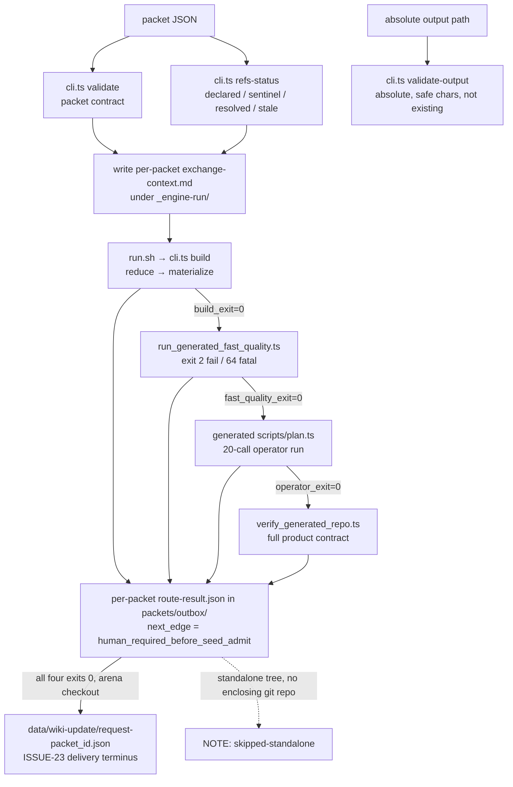

# Factory build pipeline — trigger, build, three validators

The physical entry is `sh trigger.sh <packet> <absolute-output>` (src: loop_wiki/evolve-perfect-seed-repo-factory/AGENTS.md:43-44). Everything below is mechanical script; the only LLM-facing artifact is the exchange-context file it writes for the packet.

## trigger.sh — orchestration and evidence

Steps (src: loop_wiki/evolve-perfect-seed-repo-factory/trigger.sh:1-157):

1. `cli.ts validate` and `cli.ts validate-output` — [packet contract](packet-contract.md) plus output-path safety (absolute, no NUL/CR/LF/quote/backslash, must not already exist; src: loop_wiki/evolve-perfect-seed-repo-factory/src/cli.ts:20-24).
2. `cli.ts refs-status` — the refs-status JSON is relayed verbatim; the `case "$REFS_STATUS"` guard lets exactly `declared`, `sentinel`, and `resolved` through to delivery, while `stale` FAILs **exit 2** by name (distinct message naming the broken resolve receipt) and any other unrecognized status FAILs **exit 2** generically (src: trigger.sh:19-29) — see [packet contract](packet-contract.md) for the refs_status state machine.
3. Writes `_engine-run/exchange-context.<packet_id>.md` recording packet path, fixed/iteration/emergent prompt-context ownership, source_refs, refs_status, human gate, target output (src: trigger.sh:30-43) — the prompt/context ownership model of ROUTES.md (src: loop_wiki/evolve-perfect-seed-repo-factory/ROUTES.md:34-41).
4. Runs `run.sh` with stdout/stderr captured to `_engine-run/build.<packet_id>.{out,err}` (src: trigger.sh:45-48).
5. **Three post-build validators, short-circuited** — a nonzero earlier stage leaves later stages unexecuted (recorded as their initialized exit 1; src: trigger.sh:49-69, ROUTES.md:49-51):
   - `run_generated_fast_quality.ts --repo <out>`: symlinks the factory's `node_modules` into the generated repo (refusing if one already exists), runs `bun run quality:fast` inside it, exit 2 on failure and 64 on precondition (src: loop_wiki/evolve-perfect-seed-repo-factory/src/run_generated_fast_quality.ts:14-30).
   - the generated repo's OWN operator: `bun run <out>/scripts/plan.ts --task "Validate the generated seed and surface the next bounded action"` — a real 20-call execution, not a file-presence check (src: trigger.sh:59; PROMPT.md guard metric: "File presence alone is insufficient; generated code and hollow controls run", src: loop_wiki/evolve-perfect-seed-repo-factory/PROMPT.md:31-34).
   - `verify_generated_repo.ts --repo <out>`: the full product contract — see [generated-repo](generated-repo.md).
6. Writes `packets/outbox/route-result.<packet_id>.json` (`perfect-seed-route-result@1.0.0`) with `build_exit`, `fast_quality_exit`, `operator_exit`, `validator_exit`, source_refs, refs_status, output, and always `next_edge: human_required_before_seed_admit` — "it never writes an admitted seed decision" (src: trigger.sh:70-85; ROUTES.md:43-47). Any nonzero stage makes trigger itself FAIL exit 2 with the per-stage summary line (src: trigger.sh:86-89).
7. **Wiki-update delivery terminus (ISSUE-23)** — only once all four prior exits are 0: resolves the enclosing arena with `git rev-parse --show-toplevel`; a standalone tree (no enclosing git repo, e.g. `portability.sh`'s extracted archive) makes this a NAMED skip (`wiki_update_request=skipped-standalone`) that still **exits 0** — a successful trigger delivery in which only the request emission is skipped, not a failure — so the factory stays relocatable without a skipped request masquerading as an emitted one (src: trigger.sh:104-108). Otherwise it computes a deterministic delta against `openwiki/.last-update.json`'s recorded `gitHead` — `delta_status` is `computed`, or the named absence states `no-last-update` / `unresolvable-last-head`, never a silent empty diff; in the `computed` case `changed_files` is exactly `git diff --name-only <recorded gitHead> HEAD` over the arena, JSON-encoded one path per line (src: trigger.sh:109-123) — and writes `data/wiki-update/request-<packet_id>.json` (`bettor-arena-wiki-update-request@1.0.0`) with three context lanes (fixed prompt pointers, the iteration delta, an emergent-backlog pointer), asserting the file is non-empty and JSON-valid before printing PASS (src: trigger.sh:124-157). Field by field, production here maps to a specific re-check in the consumer: `request_id` is minted as `<packet_id>@<arena HEAD>` and `git_head` as that same HEAD (src: trigger.sh:109, 129-131) — the worker requires both present; `route_result.path` is the outbox path made arena-relative via `${ROUTE_RESULT#"$ARENA"/}` (src: trigger.sh:133) — the worker requires it non-empty at parse and proves the file exists at preflight; the `fixed_prompt_context` pointer list names the two official update prompts plus `host-runtime.md` (src: trigger.sh:140-144) — the worker requires a non-empty list at parse and proves every pointer on disk at preflight; and `iteration_auto_context.delta_status` is one of the three states this step can emit — the worker rejects anything outside that enum (src: kb-ingest/port/wiki_update_worker.sh:48-95). The request's embedded `route_result` object carries not just the arena-relative `path` but the four stage exit codes AND `refs_status` verbatim (src: trigger.sh:132-139), so the digestion station sees the audit state without dereferencing the outbox file — which is also why step 2 fails closed on an unrecognized status instead of relaying it: whatever string sat in `refs_status` would otherwise be laundered downstream into this payload and the human gate's evidence. See [data ledgers](../data-ledgers.md) for the ledger shape (and why the request lands in the arena ledger, not the sandbox outbox), [data ledgers § .last-update.json](../data-ledgers.md#openwikilast-updatejson-the-wiki-freshness-anchor) for the freshness anchor the delta hangs on, and [kb-ingest official port](../kb-ingest/official-port.md#wiki_update_workersh-digestion-station-for-factory-wiki-update-requests) for the consumer.

The fast-quality result here is "local preflight evidence, not an asynchronous Code Quality or Production Use axis receipt" (src: ROUTES.md:51-52) — the same claim boundary as [the repo gate](../gates/fast-quality.md).

## run.sh and cli.ts build

`run.sh` is a one-shot dispatch: resolve packet path, `exec bun run src/cli.ts build --packet … --output … </dev/null` (src: loop_wiki/evolve-perfect-seed-repo-factory/run.sh:1-13). `build` re-validates everything, hashes the packet bytes once, derives the refs status, reduces, materializes, and prints `{"status":"candidate-human-admit-required", …receipt}` (src: loop_wiki/evolve-perfect-seed-repo-factory/src/cli.ts:104-117). Errors from any command print `FAIL: <message>` and exit 1 — except the typed `ReceiptCheckError` (unreadable resolve receipt), which exits 2: the check ran and failed on unreadable evidence (src: cli.ts:119-124; commit 2c36ddf).

## reduce.ts — the reduced IR

`reducePacket` turns the bounded source into the IR records documented in `modules/architecture.md` (source / evidence / claims / unknowns / decisions; src: loop_wiki/evolve-perfect-seed-repo-factory/modules/architecture.md:5-15). Bounds are hard constants: `MAX_SOURCE_BYTES = 512 KiB`, `MAX_REPO_FILES = 200`, `MAX_REPO_FILE_BYTES = 128 KiB`, ignored dirs `.git/node_modules/dist/coverage/__pycache__`; repo walks skip symlinks and sort entries for determinism (src: loop_wiki/evolve-perfect-seed-repo-factory/src/reduce.ts:5-40). Every evidence record carries a stable id, source_ref, sha256, excerpt (src: reduce.ts:10-15); large files keep a hash with an explicit `N/A-binary-or-large` excerpt reason (src: modules/architecture.md:25). `repo` sources are walked file-by-file into per-file evidence records; text sources (`dr`/`gcr`/`grill-me`) are read whole under `MAX_SOURCE_BYTES`; either way, a source that yields nothing fails loud — "source produced zero evidence records" (src: reduce.ts:92) — which is the G1 "nonzero evidence" validator of [the workflow](overview.md).

## materialize.ts — template → product

`materializeRepo` pins `TEMPLATE_VERSION = "perfect-seed-repo@1.1.0"`, refuses an existing output, copies `templates/repo/` (excluding its `node_modules`) with `errorOnExist`, then writes the IR data files into `data/` (src: loop_wiki/evolve-perfect-seed-repo-factory/src/materialize.ts:6-51). It closes with the provenance triple: `lineage.json` (`perfect-seed-lineage@1.0.0`, carrying packet/template/task hashes, source_refs, refs_status, and the terminal human gate), the file-hash `artifact-manifest.json` (which excludes itself and the build receipt from its own entries), and `build-receipt.json` (`perfect-seed-build-receipt@1.0.0`) binding `artifact_manifest_sha256` and `terminal_state: "candidate-human-admit-required"` (src: materialize.ts:53-87).

## Focused tests

Each pipeline behavior is pinned by name in `tests/seed_factory.test.ts` (src: loop_wiki/evolve-perfect-seed-repo-factory/tests/seed_factory.test.ts): "materializes a runnable repo from ${kind}" across all four source kinds (:89); "rejects an unknown source kind" (:129); "does not overwrite an existing output" (:137); "rejects an unsafe output path before materialization" (:147); "rejects an artifact manifest path that escapes the generated repo" (:155); "build carries source_refs through the reduced IR into the lineage manifest" (:369); "generated fast gate never removes a pre-existing local dependency symlink" (:573). The boundary rule: "The factory template is the code SSOT. Generated repos are versioned products. Runtime call plan/results may change per task; source evidence and lineage must not be rewritten to make a result look better" (src: modules/architecture.md:19-22).

The wiki-update delivery terminus (step 7) has its own `describe` block (:638): "a successful trigger delivery emits a typed wiki-update request with the three context lanes" (:643, asserts schema/request_id/route_result/all three lanes, and skips itself by name — `wiki_update_request=skipped-standalone` — outside an enclosing git repo) and "standards modules carry zero emergent content — emergent lands only in the openwiki backlog" (:695, a positive-controlled scan of `modules/` and `templates/repo/` for leaked `## Backlog`/`emergent_observation` markers) (src: loop_wiki/evolve-perfect-seed-repo-factory/tests/seed_factory.test.ts). The emission test pre-cleans `data/wiki-update/request-*.json` for its packet id and removes it again in a `finally` block — without that, a stale request from an earlier run would masquerade as this delivery's emission and the assertion would prove nothing. One drift-coupling to know before extending the delta: the three-value `delta_status` enum is hard-coded independently in `trigger.sh`, in `wiki_update_worker.sh` stage 1, and pinned by `seed_factory.test.ts` — adding a fourth status means editing all three or the producer and consumer silently disagree (src: trigger.sh:114-123; kb-ingest/port/wiki_update_worker.sh:64-66; tests/seed_factory.test.ts:638-700).
