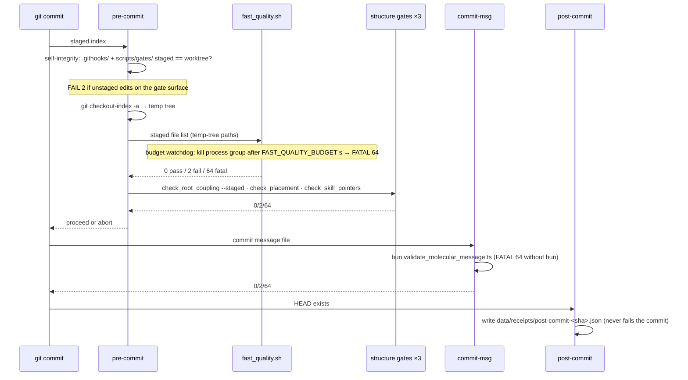

# Git hook chain — pre-commit, commit-msg, post-commit

`.githooks/` is the macro-loop's only cross-host gate layer (src: ARCHITECTURE.md:23). The hooks are tracked files, registered per clone by [bootstrap](bootstrap.md) via relative `core.hooksPath`. All three are ACTIVE: pre-commit and post-commit were armed by the admitted #14 stage 1 (commit 9c401d1), commit-msg by the #14 stage-2 human admit on 2026-08-06 (commit 38e4251; src: .githooks/commit-msg:2-4). Rollback convention for any hook: rename to `.staged` (src: .githooks/commit-msg:4) — an activation admit in reverse, see [glossary](../architecture.md).

## pre-commit — staged-only fast-quality preflight

Activated from `pre-commit.staged` by the admitted #14 stage 1 (src: .githooks/pre-commit:2-3). Three ordered jobs:

1. **Self-integrity, radius = the gate's own closure only** (`.githooks/` + `scripts/gates/`): staged vs worktree must be identical there, "otherwise the hook/gate that is running is not the one being committed" (src: .githooks/pre-commit:7-9, 31-36). This is why the whole protected surface must land in one consistent piece — partial edits to hooks/gates block every commit with FAIL 2.
2. **Judge the index bytes, never the worktree**: `git checkout-index -a --prefix` materializes the WHOLE index into a temp tree (src: .githooks/pre-commit:41-44). `-a` is full-index on purpose — staged TS files must resolve imports against tracked-but-unchanged siblings at their index bytes (src: .githooks/pre-commit:43; introduced by commit dc37c1c). Only the staged added/copied/modified/renamed paths (deletions have nothing to check, filter `--diff-filter=ACMR`, src: .githooks/pre-commit:38) are fed — rebased under the temp prefix — to `scripts/gates/fast_quality.sh`, the single check definition (see [fast quality](../gates/fast-quality.md)). Because the temp tree sits outside eslint's base path, the hook's ts-lint ride is warn-and-skip; the factory's full-scope mount carries the full eslint pass (src: .githooks/pre-commit:17-19).
3. **Structure gates** after the quality gate: `check_root_coupling.py --staged` (index blobs, not worktree), then `check_placement.py`, then `check_skill_pointers.py` (src: .githooks/pre-commit:68-71; wired by commits 9db3984 + fd164bd). See [structure gates](../gates/structure-gates.md).

**Budget watchdog.** The gate call gets `FAST_QUALITY_BUDGET` seconds (default 5) of wall clock. `set -m` puts the background gate in its own process group so the watchdog's `kill -- -pgid` reaches the gate's WHOLE tree (sh, node, tsc) — a plain kill of the pipeline leader orphaned grandchildren (src: .githooks/pre-commit:46-55; fixed by commit 186f175). Overrun is `pre-commit FATAL: fast_quality exceeded the ${BUDGET}s budget and was killed`, exit 64 — never a silent pass (src: .githooks/pre-commit:61-64). Cleanup relies on the EXIT trap, which is why the last gate calls are plain commands, not `exec` (src: .githooks/pre-commit:67).

Exit contract: 0 pass · 2 gate FAIL · 64 FATAL (budget / missing tool) (src: .githooks/pre-commit:25-26).

## commit-msg — molecular message gate

A thin shell shim: FATAL 64 naming bun when it is absent, otherwise `exec bun run .githooks/lib/validate_molecular_message.ts "$1"` (src: .githooks/commit-msg:7-13). The validator's contract — required fields, protected surface, Intent-Slice vocabulary — is its own page: [molecular messages](molecular-messages.md).

## post-commit — record-only stage-request receipt

Writes one JSON receipt per commit to `data/receipts/post-commit-<sha>.json` with kind `stage-request`, sha, branch, and UTC timestamp; uses git + sh only, starts no worker, blocks nothing, and never fails the commit — "it already exists" (src: .githooks/post-commit:2-13). These runtime receipts are gitignored (`data/receipts/post-commit-*.json`, src: .gitignore:4) — see [data ledgers](../data-ledgers.md). Historical anchor: the hook needed its executable bit restored to actually fire (commit a61e9be).

## Focused tests

- `tests/test_fast_quality.sh` drives the REAL pre-commit in an isolated fixture repo: three per-lane negative controls (TS type error, Python format violation, shell syntax error), a clean positive control, a fail-fast `not_run` assertion, a ruff-absent FATAL 64, a hook self-integrity block, a budget-overrun FATAL, and a <5s wall bound (src: tests/test_fast_quality.sh:2-11).
- `tests/test_molecular_gate.sh` asserts the armed hooks are live AND executable — "an armed hook would be silently ignored" without the x-bit — then exercises commit behavior in a fixture (src: tests/test_molecular_gate.sh:14-18). The seam test tracks the armed hooks it judges (commit 07e0a20).
