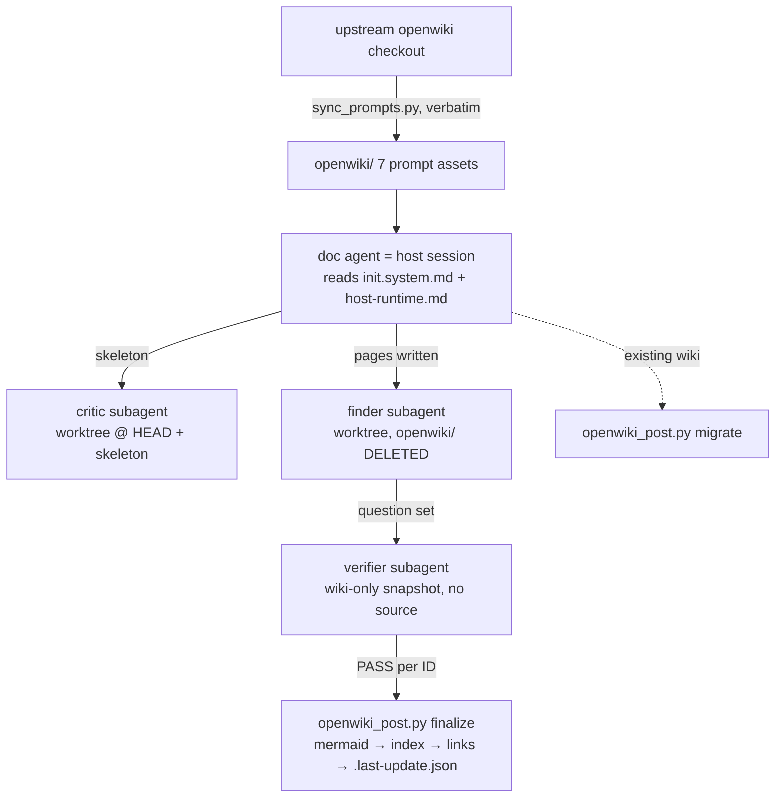

# kb-ingest official port — prompts, passes, isolated subagents

Upstream pin: `langchain-ai/openwiki @ 9a02b351…` (each asset's provenance header names the commit it was extracted from; src: kb-ingest/skill/modules/official-port-map.md:3-5). The full mechanism-by-mechanism map, deliberate divergences, and honest gaps live in `kb-ingest/skill/modules/official-port-map.md`; this page summarizes each port asset with its load-bearing design choices.

## sync_prompts.py — the verbatim generator

Extracts the official prompts from an openwiki checkout (`src/agent/prompts/code.ts`, `skeleton_critic.ts`, `wiki_qa_subagents.ts`) into the seven assets of `kb-ingest/openwiki/`, resolving placeholders for no `--language` and no `.openwikiignore` (src: kb-ingest/port/README.md:35-44). Why a generator: "the port's central claim is 'the prompt text is byte-identical to upstream'. Hand-copied markdown makes that claim unfalsifiable after the first typo; a generator makes `git diff` the proof and an upstream upgrade one command" (src: kb-ingest/port/README.md:45-47). `--check` proves non-drift at any time.

Extraction mechanics: `literal_after` locates a named anchor in the upstream TS source and `read_template_literal` reads the backtick template literal that follows, honoring escapes; `apply_placeholders` then substitutes each placeholder with `str.replace(key, value, 1)` — capped at ONE occurrence to mirror JavaScript's `String.replace` semantics exactly, so a placeholder appearing twice behaves byte-identically to upstream (src: kb-ingest/port/sync_prompts.py:93-154). Its `--selftest` round-trips the escape cases the extractor must survive. On the gate side, `check_prompt_assets` verifies provenance needles (`DO NOT EDIT BY HAND`, the `OPENWIKI-OFFICIAL` markers, no unresolved `{PLACEHOLDER}` in system prompts) AND content spot-checks — e.g. the init prompt must still contain "Do not document every file or target a page count" — so a truncated or stale asset cannot pass on markers alone (src: kb-ingest/check_repo_wiki_converge.py:375-400).

## openwiki_post.py — the code-owned passes

Upstream's `okf-middleware.ts` wraps every run with deterministic passes the prompts reference as accomplished facts; without them, lines like "Directory index.md files are generated deterministically after the run" are dead letters (src: kb-ingest/port/openwiki_post.py:3-17). Subcommands: `migrate` (upstream `beforeAgent: migrateWikiToOkf`) and `finalize` (upstream `afterAgent`: mermaid validation → index generation → internal-link validation → `.last-update.json`) (src: kb-ingest/port/host-runtime.md:30-37). Declared fidelity notes (src: openwiki_post.py:19-32): mermaid uses the heuristic path only (no Node; upstream documents it as valid — under-reports, never over-reports); index ordering is byte sort not `localeCompare`; heading slugs use Python `\w`; and `PRESERVED_EXTENSION_FIELDS` is DELIBERATELY WIDER than upstream — upstream preserves only `openwiki_translation_pending` across a front-matter rebuild, which would silently drop the RepoDoc routing fields on exactly the already-malformed pages and break KB ingest with zero signal (src: kb-ingest/port/repodoc-extension.md:48-54). `--protect <rel>` shields pages some other tool generates and byte-asserts (src: kb-ingest/port/README.md:64-66).

**Mechanics worth knowing before touching a wiki by hand** (src: kb-ingest/port/openwiki_post.py):

- The rebuild-or-not decision is owned by `normalize_concept_content` and hinges SOLELY on `has_usable_type`: a page with a usable `type` is returned untouched "however junky its optional fields"; otherwise the block is rebuilt from the body (deriving title from the first `#` heading or the filename), stamped `openwiki_generated: true`, and the `PRESERVED_EXTENSION_FIELDS` — `openwiki_translation_pending` plus the RepoDoc fields `node_kind`/`ingest_lane`/`repo`/`repo_url`/`commit`/`covers`/`libraries`/`generated_by`/`generated_at`/`source` — are carried over from the old block (src: openwiki_post.py:71-75, 180-207).
- `read_field` is a line-based parser ON PURPOSE (no YAML dependency): anything it cannot read reports absent, which routes `type` to the safe rebuild path and optional display fields to omission (src: openwiki_post.py:119-131).
- `PROTECTED` pages are "still indexed and still read for link targets; they are only never written" — the divergence exists because a target can hold a page another generator byte-asserts, and repairing it would turn a completely separate gate red (src: openwiki_post.py:79-92).
- Mermaid degradation flags only near-certain breakages via three conservative heuristics (reserved `end` node in flowcharts, semicolons and unescaped angle brackets inside labels), converts the fence to `text`, and stamps an HTML comment starting `openwiki: mermaid parse failed` with the reason — a valid diagram is never degraded (src: openwiki_post.py:253-297). `extract_mermaid_fences` tracks fence nesting so an inner fence never miscounts (src: openwiki_post.py:226-251).
- Link validation is idempotent by construction: `pass_links` strips existing stamps, re-validates against the page set and heading anchors, then re-stamps — "re-runs neither accumulate stamps nor change bytes" — and never writes protected pages (src: openwiki_post.py:502-515).
- `write_last_update` records `updatedAt`/`command`/`model`/`status` plus the target's `gitHead`, which the official update prompt reads back and this repo's bootstrap doctor compares against HEAD (src: openwiki_post.py:518-533; bootstrap.sh openwiki WARN block).
- `pass_backlog_heading` (opt-in `--normalize-backlog`) canonicalizes quickstart's Backlog heading; it is opt-in because the v1 lane is a control for a running measurement (src: openwiki_post.py:544-559).
- Heading anchors follow GitHub's duplicate-suffix rule — a repeated heading slug gets `-1`, `-2`, … — so links to the second occurrence of a heading validate correctly (src: openwiki_post.py:305-319, selftest assertion `heading_anchors("# A B\n## A B\n") == {"a-b", "a-b-1"}` at :651).
- `pass_backlog_heading` is asserted-before-announced: after the rewrite it re-searches the heading, and if the result is not canonical it prints `[FAIL]` instead of the success line — "the bug this pass exists to prevent was a success message printed by a removal that had silently matched nothing" (src: openwiki_post.py:566-576).
- `--selftest` proves protected-page byte-equality, stamp idempotency (one missing file + one missing anchor counted, re-run byte-stable), mermaid degradation, GitHub duplicate-anchor suffixes, index generation, and backlog normalization (a decorated heading normalized with its title text kept) before any real run trusts the passes (src: openwiki_post.py:622-698).

## openwiki_subagent.sh — physically isolated review subagents

Runs the three official reviewers as isolated child processes on Claude Code or Codex CLI. The read boundary is "the directory the child can see", not prose (src: kb-ingest/port/openwiki_subagent.sh:12-27):

- **critic** — throwaway `git worktree` at TARGET HEAD with only `_skeleton.md` copied in; read-only reviewer, mandated to map the repo independently BEFORE reading the skeleton (src: kb-ingest/openwiki/subagents/skeleton-critic.md:22-24), two-round maximum hard-coded in its prompt (initial review must return ALL material gaps; exactly one repeat review).
- **finder** — same worktree with `openwiki/` DELETED: "it cannot read the wiki because the wiki is not there" (src: openwiki_subagent.sh:21-24, 119-124).
- **verifier** — cwd is a scratch copy of the wiki ONLY, keeping the `openwiki/` path prefix because "path SHAPE is part of the contract" (the official prompt searches `/openwiki`), with `_skeleton.md`/`_plan.md` stripped so intent cannot be mistaken for content (src: openwiki_subagent.sh:76-95). A leaked `scripts/` dir in the verifier sandbox is FATAL (src: openwiki_subagent.sh:158-161).

This is STRONGER than upstream, where deepagents subagents share one virtual filesystem and boundaries are prose-only (src: kb-ingest/port/README.md:78-82).

Two structural details of the runner: a worktree is only the right sandbox when TARGET is the root of its OWN repository — a vendored subdirectory would check out the ENCLOSING repo, "handing the child the whole parent tree", so the runner falls back to a `.git`-stripped copy (with a printed note that target git history is unavailable to that child) when `git rev-parse --show-toplevel` differs from TARGET (src: openwiki_subagent.sh:98-116). And the cleanup trap fires only for REGISTERED worktrees (`WT_REPO` set on the worktree path only), so a copied sandbox never triggers a bogus `git worktree remove` (src: openwiki_subagent.sh:67-74). Host dispatch is concrete, not prose: Claude runs `claude -p --system-prompt … --allowedTools Read Grep Glob [+ read-only git/rg/ls Bash specifiers for critic/finder] --add-dir <sandbox> --no-session-persistence` from inside the sandbox; Codex runs `codex exec -C <sandbox> -s read-only --skip-git-repo-check --ephemeral` with the system prompt prepended, its reasoning trace parked in `<role>-trace.log` (src: openwiki_subagent.sh:185-206). Other mechanics: shape assertions per role before spending a turn; `OPENWIKI_DRY_RUN` lists what the child would see without invoking a model; `OPENWIKI_LABEL` keeps concurrent verifier batches from overwriting each other; outputs land in `<TARGET>/.openwiki-review/<role>[-label]-latest.txt` — deliberately OUTSIDE `openwiki/` because anything inside the wiki tree becomes a section directory to the index generator; empty output or nonzero child status is FATAL — "an empty review is NOT a pass" (src: openwiki_subagent.sh:133-147, 208-213). Host dispatch: Claude gets the official system prompt via `--system-prompt` with an allowlisted read-only tool set; Codex gets it prepended to the turn under `-s read-only` (src: openwiki_subagent.sh:185-206).

## test_relocation.sh — the gate's own red

Copies the module into a throwaway host under a different name at a different depth, runs the core gate there, then breaks it once per failure mode and requires the specific exit code back (1 broken claim, 3 cannot-tell). Rationale: "the gate passing where it already lives proves little; every host assumption is satisfied by accident there", and a positive control cannot distinguish "checks passed" from "checks resolved nothing" — precisely how a relocation refactor fails. Deliberately NOT wired into the gate (the gate would call the script that calls the gate) (src: kb-ingest/port/README.md:21-33).

## host-runtime.md and repodoc-extension.md — the adapters

`host-runtime.md` maps upstream's virtual filesystem onto a real host (`/` = TARGET; host-absolute paths downgraded from hard rule to convention; the code-owned-pass table; the not-ported list: translation, `.openwikiignore`, connectors, LangSmith, visualizer, telemetry, personal mode) (src: kb-ingest/port/host-runtime.md:10-27, 67-72). `repodoc-extension.md` defines the producer-extension front-matter fields (`node_kind`, `repo`, `commit`, `covers`, `libraries`, …) that are OKF-legal rather than a fork, plus the vocabulary discipline that keeps `covers`/`libraries` from fragmenting a knowledge graph (src: kb-ingest/port/repodoc-extension.md:3-13, 40-45).

## Honest gaps (no local equivalent, cost stated)

From the port map (src: kb-ingest/skill/modules/official-port-map.md:44-56): per-write front-matter feedback (upstream validates on every write and feeds errors back mid-run; here only batch repair — a bad page survives until finalize stamps `openwiki_generated: true`, to be fixed next update); the **anti-fabrication layer** (the retired `verify-claims.sh` gave `(src: path:line)` anchors + verbatim-quote checking; removed to keep prompts 100% official — the official gates catch "the wiki cannot answer", not "it answers with invented numbers", so the human admit must hunt concrete numbers itself); target AGENTS.md/CLAUDE.md OPENWIKI-block maintenance (never ported — this port never edits the target's agent files); and the honest 2026-08 note that the NO-API-KEY differentiation has shrunk to the Claude lane only, since upstream now supports ChatGPT-subscription OAuth (src: official-port-map.md:58-62). The retired-assets ledger (distilled workflow, judge/refine prompts, agy-pass, verify-claims — last present at commit b8d076a) and the retained `engine-baseline.md` evidence are in §4 of the port map (src: official-port-map.md:64-77).
