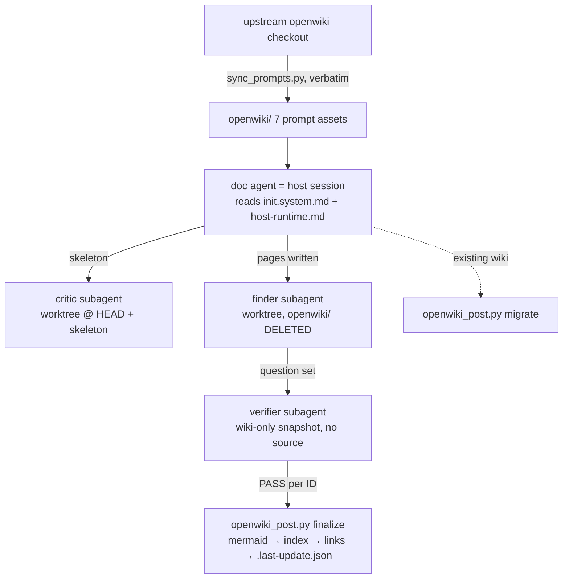
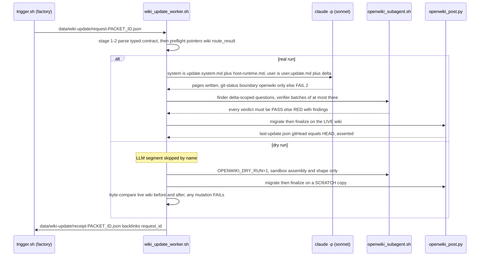

# kb-ingest official port — prompts, passes, isolated subagents

Upstream pin: `langchain-ai/openwiki @ 9a02b351…` (each asset's provenance header names the commit it was extracted from; src: kb-ingest/skill/modules/official-port-map.md:3-5). The full mechanism-by-mechanism map, deliberate divergences, and honest gaps live in `kb-ingest/skill/modules/official-port-map.md`; this page summarizes each port asset with its load-bearing design choices.

## sync_prompts.py — the verbatim generator

Extracts the official prompts from an openwiki checkout (`src/agent/prompts/code.ts`, `skeleton_critic.ts`, `wiki_qa_subagents.ts`) into the seven assets of `kb-ingest/openwiki/`, resolving placeholders for no `--language` and no `.openwikiignore` (src: kb-ingest/port/README.md:35-44). Why a generator: "the port's central claim is 'the prompt text is byte-identical to upstream'. Hand-copied markdown makes that claim unfalsifiable after the first typo; a generator makes `git diff` the proof and an upstream upgrade one command" (src: kb-ingest/port/README.md:45-47). `--check` proves non-drift at any time.

Extraction mechanics: `literal_after` locates a named anchor in the upstream TS source and `read_template_literal` reads the backtick template literal that follows, honoring escapes; `apply_placeholders` then substitutes each placeholder with `str.replace(key, value, 1)` — capped at ONE occurrence to mirror JavaScript's `String.replace` semantics exactly, so a placeholder appearing twice behaves byte-identically to upstream (src: kb-ingest/port/sync_prompts.py:93-154). Its `--selftest` round-trips the escape cases the extractor must survive. On the gate side, `check_prompt_assets` verifies provenance needles (`DO NOT EDIT BY HAND`, the `OPENWIKI-OFFICIAL` markers, no unresolved `{PLACEHOLDER}` in system prompts) AND content spot-checks — e.g. the init prompt must still contain "Do not document every file or target a page count" — so a truncated or stale asset cannot pass on markers alone (src: kb-ingest/check_repo_wiki_converge.py:375-400).

## openwiki_post.py — the code-owned passes

Upstream's `okf-middleware.ts` wraps every run with deterministic passes the prompts reference as accomplished facts; without them, lines like "Directory index.md files are generated deterministically after the run" are dead letters (src: kb-ingest/port/openwiki_post.py:3-17). Subcommands: `migrate` (upstream `beforeAgent: migrateWikiToOkf`) and `finalize` (upstream `afterAgent`: mermaid validation → index generation → internal-link validation → `.last-update.json`) (src: kb-ingest/port/host-runtime.md:30-37). Declared fidelity notes (src: openwiki_post.py:19-32): mermaid uses the heuristic path only (no Node; upstream documents it as valid — under-reports, never over-reports); index ordering is byte sort not `localeCompare`; heading slugs use Python `\w`; and `PRESERVED_EXTENSION_FIELDS` is DELIBERATELY WIDER than upstream — upstream preserves only `openwiki_translation_pending` across a front-matter rebuild, which would silently drop the RepoDoc routing fields on exactly the already-malformed pages and break KB ingest with zero signal (src: kb-ingest/port/repodoc-extension.md:48-54). `--protect <rel>` shields pages some other tool generates and byte-asserts (src: kb-ingest/port/README.md:64-66).

**Mechanics worth knowing before touching a wiki by hand** (src: kb-ingest/port/openwiki_post.py):

- The rebuild-or-not decision is owned by `normalize_concept_content` and hinges SOLELY on `has_usable_type`: a page with a usable `type` is returned untouched "however junky its optional fields"; otherwise the block is rebuilt from the body (deriving title from the first `#` heading or the filename), stamped `openwiki_generated: true`, and the `PRESERVED_EXTENSION_FIELDS` — `openwiki_translation_pending` plus the RepoDoc fields `node_kind`/`ingest_lane`/`repo`/`repo_url`/`commit`/`covers`/`libraries`/`generated_by`/`generated_at`/`source` — are carried over from the old block (src: openwiki_post.py:71-75, 180-207).
- `read_field` is a line-based parser ON PURPOSE (no YAML dependency): anything it cannot read reports absent, which routes `type` to the safe rebuild path and optional display fields to omission (src: openwiki_post.py:119-131).
- `PROTECTED` pages are "still indexed and still read for link targets; they are only never written" — the divergence exists because a target can hold a page another generator byte-asserts, and repairing it would turn a completely separate gate red (src: openwiki_post.py:79-92).
- Mermaid degradation flags only near-certain breakages via three conservative heuristics (reserved `end` node in flowcharts, semicolons and unescaped angle brackets inside labels), converts the fence to `text`, and stamps an HTML comment starting `openwiki: mermaid parse failed` with the reason — a valid diagram is never degraded (src: openwiki_post.py:253-297). `extract_mermaid_fences` tracks fence nesting so an inner fence never miscounts (src: openwiki_post.py:226-251).
- Link validation is idempotent by construction: `pass_links` strips existing stamps, re-validates against the page set and heading anchors, then re-stamps — "re-runs neither accumulate stamps nor change bytes" — and never writes protected pages (src: openwiki_post.py:502-515).
- `write_last_update` records `updatedAt`/`command`/`model`/`status` plus the target's `gitHead`, which the official update prompt reads back and this repo's bootstrap doctor compares against HEAD (src: openwiki_post.py:518-533; bootstrap.sh openwiki WARN block).
- `pass_backlog_heading` (opt-in `--normalize-backlog`) canonicalizes quickstart's Backlog heading. Mechanics: it matches any heading line of the form `## Backlog<rest>` (the `BACKLOG_HEADING` regex captures whatever trails on that line — e.g. `## Backlog - known gaps, with anchors`, which one official run actually produced); if the trailing text is non-empty, the heading is rewritten to exactly `## Backlog` and the trailing text — stripped of leading dash/em-dash/colon decoration — is preserved as the section's first line rather than discarded. An already-canonical or absent heading is a 0-count no-op. It is opt-in because the v1 lane is a control for a running measurement (src: openwiki_post.py:541-576).
- Heading anchors follow GitHub's duplicate-suffix rule — a repeated heading slug gets `-1`, `-2`, … — so links to the second occurrence of a heading validate correctly (src: openwiki_post.py:305-319, selftest assertion `heading_anchors("# A B\n## A B\n") == {"a-b", "a-b-1"}` at :651).
- `pass_backlog_heading` is asserted-before-announced: after the rewrite it re-searches the heading, and if the result is not canonical it prints `[FAIL]` instead of the success line — "the bug this pass exists to prevent was a success message printed by a removal that had silently matched nothing" (src: openwiki_post.py:566-576).
- `--selftest` proves protected-page byte-equality, stamp idempotency (one missing file + one missing anchor counted, re-run byte-stable), mermaid degradation, GitHub duplicate-anchor suffixes, index generation, and backlog normalization (a decorated heading normalized with its title text kept) before any real run trusts the passes (src: openwiki_post.py:622-698).

## openwiki_subagent.sh — physically isolated review subagents

Runs the three official reviewers as isolated child processes on Claude Code or Codex CLI. The read boundary is "the directory the child can see", not prose (src: kb-ingest/port/openwiki_subagent.sh:12-27):

- **critic** — throwaway `git worktree` at TARGET HEAD with only `_skeleton.md` copied in; read-only reviewer, mandated to map the repo independently BEFORE reading the skeleton (src: kb-ingest/openwiki/subagents/skeleton-critic.md:22-24), two-round maximum hard-coded in its prompt (initial review must return ALL material gaps; exactly one repeat review).
- **finder** — same worktree with `openwiki/` DELETED: "it cannot read the wiki because the wiki is not there" (src: openwiki_subagent.sh:21-24, 119-124).
- **verifier** — cwd is a scratch copy of the wiki ONLY, keeping the `openwiki/` path prefix because "path SHAPE is part of the contract" (the official prompt searches `/openwiki`), with `_skeleton.md`/`_plan.md` stripped so intent cannot be mistaken for content (src: openwiki_subagent.sh:76-95). A leaked `scripts/` dir in the verifier sandbox is FATAL (src: openwiki_subagent.sh:158-161).

This is STRONGER than upstream, where deepagents subagents share one virtual filesystem and boundaries are prose-only (src: kb-ingest/port/README.md:78-82).

Two structural details of the runner: a worktree is only the right sandbox when TARGET is the root of its OWN repository — a vendored subdirectory would check out the ENCLOSING repo, "handing the child the whole parent tree", so the runner falls back to a `.git`-stripped copy (with a printed note that target git history is unavailable to that child) when `git rev-parse --show-toplevel` differs from TARGET (src: openwiki_subagent.sh:98-116). And the cleanup trap fires only for REGISTERED worktrees (`WT_REPO` set on the worktree path only), so a copied sandbox never triggers a bogus `git worktree remove` (src: openwiki_subagent.sh:67-74). Host *selection* first: the `OPENWIKI_HOST` env var picks the lane explicitly (`claude` or `codex`); when unset, the runner defaults to `codex` when it is on PATH (its `-C` plus `-s read-only` make the boundary a sandbox, not an instruction), else `claude`, and FATALs when neither exists. There is no unrecognized-value error: dispatch is a single `[ "$HOST" = "codex" ]` test, so any other value — a typo included — falls through to the claude branch (src: openwiki_subagent.sh:28-30, 54-59, 183). Host dispatch is concrete, not prose: Claude runs `claude -p --system-prompt … --allowedTools Read Grep Glob [+ read-only git/rg/ls Bash specifiers for critic/finder] --add-dir <sandbox> --no-session-persistence` from inside the sandbox; Codex runs `codex exec -C <sandbox> -s read-only --skip-git-repo-check --ephemeral` with the system prompt prepended, its reasoning trace parked in `<role>-trace.log` (src: openwiki_subagent.sh:185-206). Other mechanics: shape assertions per role before spending a turn; under `OPENWIKI_DRY_RUN` the runner still performs the FULL sandbox assembly and the per-role shape assertions (verifier: `openwiki/*.md` present and no leaked `scripts/`; finder: no `openwiki/`; critic: `_skeleton.md` present), then prints the system-prompt line count, payload byte count, and the sandbox top level and exits 0 WITHOUT invoking the host — that exit 0 is therefore evidence of plumbing and sandbox shape only, never evidence that any question was answered from the wiki (src: openwiki_subagent.sh:155-181); `OPENWIKI_LABEL` keeps concurrent verifier batches from overwriting each other; outputs land in `<TARGET>/.openwiki-review/<role>[-label]-latest.txt` — deliberately OUTSIDE `openwiki/` because anything inside the wiki tree becomes a section directory to the index generator, and gitignored since ISSUE-23 (src: .gitignore:7) now that a real per-repo update run (below) leaves review scratch behind; empty output or nonzero child status is FATAL — "an empty review is NOT a pass" (src: openwiki_subagent.sh:133-147, 208-213). Host dispatch: Claude gets the official system prompt via `--system-prompt` with an allowlisted read-only tool set; Codex gets it prepended to the turn under `-s read-only` (src: openwiki_subagent.sh:185-206).

## wiki_update_worker.sh — digestion station for factory wiki-update requests

Consumes the typed request the factory delivery terminus writes to `data/wiki-update/` (see [build pipeline](../factory/build-pipeline.md) and [data ledgers](../data-ledgers.md)) and walks the official update pipeline end to end with no human in the loop for the mechanical stages (src: kb-ingest/port/wiki_update_worker.sh:1-29). It is a standalone consumer, not part of the module's own perception gate: neither `check_repo_wiki_converge.py` nor SKILL.md reference it, because it operates on the HOST checkout's live `openwiki/`, not the module's own asset set.

The interpreter requirement is self-enforcing rather than a shebang promise: the write-boundary gate (below) needs bash's process substitution, but the script is conventionally invoked as `sh worker.sh`; a guard at the top (`[ -n "${BASH_VERSION:-}" ] || exec bash "$0" "$@"`) re-execs into bash instead of running degraded under POSIX sh, which would otherwise silently neuter that gate — observed live on the first power-on run, where the failure scrolled past and the run continued with a no-op boundary check that still looked green (src: wiki_update_worker.sh:30-33).

Stage-by-stage (src: kb-ingest/port/wiki_update_worker.sh):

- **Parse + preflight** — a typed contract that re-checks, field by field, what `trigger.sh` produced. The per-field mapping from production site to re-check:
  - `request_id` — produced as `<packet_id>@<git_head>` (src: trigger.sh:129); stage 1 requires its presence (src: wiki_update_worker.sh:65-69).
  - `packet_id` — sed-extracted from the packet, empty is FAIL at the producer already (src: trigger.sh:13-17, 131); stage 1 requires its presence (src: wiki_update_worker.sh:65-69).
  - `route_result.path` — written arena-relative via `${ROUTE_RESULT#"$ARENA"/}` (src: trigger.sh:133); stage 1 requires it non-empty (src: wiki_update_worker.sh:70-72) and stage 2 proves the file exists on disk under the root (src: wiki_update_worker.sh:104).
  - `fixed_prompt_context` — the three official-prompt pointers (src: trigger.sh:140-144); stage 1 requires a non-empty list (src: wiki_update_worker.sh:73-75) and stage 2 proves EVERY pointer resolves to a file (src: wiki_update_worker.sh:100-102).
  - `iteration_auto_context` — the trigger's three-state delta computation (src: trigger.sh:110-123); stage 1 re-validates `delta_status` against the same three-name enum `computed`/`no-last-update`/`unresolvable-last-head` (src: wiki_update_worker.sh:76-78).
  - `emergent_prompt_context` — the backlog pointer (src: trigger.sh:150); stage 1 requires its presence (src: wiki_update_worker.sh:65-69).

  Every miss is a named exit 2, never a bare KeyError; stage 2 additionally proves `openwiki/` exists and that the gate runner and post processor are present. The FATAL-64 class at these two stages is exactly: an absent request file, `python3` missing from PATH, an unresolvable arena root, and an absent gate runner or post processor — absent preconditions and tools, distinct from the exit-2 broken-claim class above (src: wiki_update_worker.sh:52-107). The worker's root is `git rev-parse --show-toplevel` from its own location; the `WIKI_WORKER_ROOT` env var replaces that root resolution wholesale, so every subsequent path — context pointers, `openwiki/`, the `route_result` file, and the `data/wiki-update/` ledger it writes into — resolves under the override instead of the enclosing repo; it exists for selftest fixtures only, so fixture runs never resolve to (or touch) the real arena (src: wiki_update_worker.sh:26, 49-50). The request itself lands in the arena ledger `data/wiki-update/` rather than the sandbox `packets/outbox/` BECAUSE of this consumer: the digestion station must never depend on sandbox layout, so the producer delivers into the arena-owned ledger (src: trigger.sh:91-95).
- **LLM regeneration** — real runs only; dry-run skips it by name so the deterministic chain proof spends no model turn. `claude -p` is invoked with `--model sonnet --permission-mode acceptEdits --add-dir openwiki/` and a narrow read-only Bash allowlist (`git log/show/diff/rev-parse`, `rg`, `ls`) mirroring `openwiki_subagent.sh`'s own allowlist. The write boundary is a GATE, not a promise, and its mechanics are exact: sorted `git status --porcelain` snapshots are taken before and after the model turn, `comm -13` isolates only the NEW lines, `cut -c4-` strips the two status characters plus separator to leave bare paths, and any survivor of `grep -v '^openwiki/'` is FAIL 2 naming the stray paths — pre-existing dirt therefore never trips the gate, only what this regeneration added (src: wiki_update_worker.sh:164-189). The run transcript is `mv`ed into `data/wiki-update/regen-<packet_id>.json` only AFTER that boundary snapshot, deliberately: written earlier it would itself appear as a new non-`openwiki/` path and the log would read as a stray write (src: wiki_update_worker.sh:190-194). Prompt composition extracts the text between the `OPENWIKI-OFFICIAL:BEGIN/END` markers via the `official()` helper (a markerless file is used whole — a fixture affordance; a real markerless asset would already have failed `sync_prompts.py --check`), appends `host-runtime.md` as the system-prompt adapter, and fills the official `user.update.md` template: `{WIKI_GOAL}` from `openwiki/INSTRUCTIONS.md` if present else a default goal sentence, `{ADDITIONAL_USER_REQUEST}` empty, `{RUNTIME_CONTEXT}` the request's delta block (src: wiki_update_worker.sh:125-163).
- **Review gates** — reuses `openwiki_subagent.sh` exactly as the init flow does: finder generates delta-scoped questions from source with no wiki in its sandbox, verifier answers them from the wiki alone in batches of ≤3, and any non-PASS verdict is a red gate with the findings printed so a human can repair the named pages and rerun. The finder payload is composed inline: a header naming the `request_id`, the statement that the wiki was just updated, the request's `changed_files` list, and the instruction to generate questions per its own system prompt (src: wiki_update_worker.sh:230-237). The worker takes only the LAST stdout line of an `openwiki_subagent.sh` invocation as the review-file path — the runner prints progress diagnostics (`[<role>] host=… sandbox=…`, sandbox notes) on stdout before echoing that path as its final line, so anything but the last line would hand the parser a log message instead of a filename (src: wiki_update_worker.sh:239-241; openwiki_subagent.sh:171, 215). A finder output containing zero `[Q-NN]` question blocks is its own named red — "finder returned no [Q-NN] questions" naming the review file — distinct from both a failed finder run and the verdict-parser reds below (src: wiki_update_worker.sh:243-263). The finder's output is split on lines matching `^\[Q-\d+\]:` and grouped into batch files of at most three question blocks; each batch runs with `OPENWIKI_LABEL="b$i"`, which is what makes the runner write per-batch `verifier-b<i>-latest.txt` files instead of the last batch silently overwriting the rest (src: wiki_update_worker.sh:243-272; openwiki_subagent.sh:133-137). A failing batch records its exit code into `gate_verifier` (last non-zero wins) but the loop still runs every batch, so one broken batch never hides another's verdicts; any non-zero afterwards is a run failure distinct from a verdict failure (src: wiki_update_worker.sh:264-272). The verdict parser then enumerates its own failure modes as reds, never implicit greens: a missing `verifier-b<i>-latest.txt` is FAIL, a review with no `<result>` blocks is FAIL, and any result whose status is not `PASS` is collected into the printed findings (src: wiki_update_worker.sh:273-297). Critic is recorded `skipped-no-skeleton` — an update flow has no `_skeleton.md`, and an unexpected one is itself a FAIL ("finish or clean the init run first") (src: wiki_update_worker.sh:224-226).
- **Post passes** — reuses `openwiki_post.py migrate`/`finalize` exactly as the init flow does. Real runs invoke finalize on the LIVE wiki as `openwiki_post.py finalize <root>/openwiki --target "$root" --command update --model claude-code+sonnet --status success --normalize-backlog` — `gitHead` is therefore the worker-root target repo's HEAD, and the ordered finalize chain is mermaid → indexes → links → `.last-update.json` → backlog heading (`--normalize-backlog` keeps the `## Backlog` heading in `quickstart.md` stable, which is what the emergent lane's `openwiki/quickstart.md#backlog` pointer relies on; `index.md` files must never be hand-written because this chain deterministically regenerates and overwrites them), then delete `openwiki/_plan.md` — mirroring upstream's "removed automatically after the run" middleware behavior the official prompt states as fact — and assert `.last-update.json`'s `gitHead` (extracted with a strict 40-hex `sed` pattern) equals `git rev-parse HEAD` before announcing — a mismatch (including a `gitHead`-less file) is a named FAIL 2. The `gitHead`-less case is reachable because `write_last_update` runs its `git rev-parse HEAD` with `check=False` and stderr to DEVNULL and simply drops the key on empty stdout — a git failure never raises, it silently omits (src: kb-ingest/port/openwiki_post.py:527-532); dry-runs finalize a SCRATCH copy while a second pre-run copy named `live-before` is kept, and the live wiki is compared against it with `diff -r`; that comparison is asserted BEFORE any success line prints — "dry-run mutated the live wiki" is a FAIL 2, never a postscript (src: wiki_update_worker.sh:305-323). Be precise about what a green dry-run does NOT prove about a real run: no model turn and therefore no write-boundary gate exercise, no real verifier verdicts (gates are sandbox-shape assertions only), no live finalize, no `_plan.md` removal, and no `gitHead`-equals-HEAD assert — the receipt records the skipped segment in its `llm_regenerate` field (fed by the worker-internal `regenerate_state` variable) as `skipped-dry-run`, a named absence (src: wiki_update_worker.sh:106-115, 350-370). Ownership of `.last-update.json` itself is documented on [data ledgers](../data-ledgers.md#openwikilast-updatejson-the-wiki-freshness-anchor).
- **Receipt** — `data/wiki-update/receipt-<packet_id>.json` (`bettor-arena-wiki-update-receipt@1.0.0`) back-links `request_id`; collision-refused (exit 64) unless `WIKI_UPDATE_FORCE_RECEIPT=1` — the same frozen-evidence discipline as the migration engine's `--force-receipt` (src: wiki_update_worker.sh:335-372). Four details are load-bearing here:
  - **The stage-field type split is deliberate.** `gate_finder`, `gate_verifier`, `post_migrate`, `post_finalize` are serialized as integers (`int(os.environ[...])`) — they are always real exit codes — while `gate_critic` and `llm_regenerate` stay strings, because they can carry a named-absence sentinel instead of a code: `gate_critic` is `"skipped-no-skeleton"` in every update flow (critic belongs to init) and `llm_regenerate` is `"skipped-dry-run"` or `"ran:model=sonnet,changed=N"`. A reader can therefore distinguish "ran and exited 0" from "skipped by name" without a second field (src: wiki_update_worker.sh:117-119, 218, 227, 347-363).
  - **Why collision is 64, not 2.** Exit 2 is the contract-fail class: this run's own content failed a check. Exit 64 is the FATAL class: an environment or evidence precondition (absent input, absent tool) — and a pre-existing receipt is exactly that, a refusal to overwrite frozen evidence before the run writes anything, not a judgement about this run's content (src: wiki_update_worker.sh:28-29, 341-343). `WIKI_UPDATE_FORCE_RECEIPT=1` disables precisely that pre-write existence refusal and nothing else — every other stage and assertion is identical under force (src: wiki_update_worker.sh:341-343).
  - **Stage 6 asserts before announcing**: after the write, the receipt file is re-checked non-empty and re-parsed as JSON, and only then does the `PASS:` line print (src: wiki_update_worker.sh:370-373).
  - **The collision refusal is the ONLY immutability this ledger gets.** `data/wiki-update/` is gitignored in full, alongside `data/receipts/post-commit-*.json` and `.openwiki-review/` (src: .gitignore:4-7) — so unlike tracked frozen evidence, git history protects none of it; the existence check at write time is the entire enforcement.
- **`--selftest`** — fixture-driven, no network/model dependency for its negative controls. The named cases and their required exit codes: `absent-request-is-fatal-64` (64), `non-json-request` (2), `foreign-schema` (a rewritten `schema_version`, 2), `missing-field` (`packet_id` stripped, 2), then the two wired-LLM-segment controls `real-run-absent-claude-is-fatal-64` (a nonexistent `WIKI_UPDATE_CLAUDE_BIN` must exit 64 AND the diagnostic must contain "claude CLI absent" — tool absence naming itself, not a TODO) and `real-run-stray-write-is-fail-2` (a fake `claude` that writes outside `openwiki/` must FAIL 2 at the boundary gate, before any review gate runs — both real-run controls die before any model turn, keeping the selftest deterministic); `good-dry-run` (0, and the receipt must exist AND back-link the fixture `request_id`); finally the frozen-evidence pair `receipt-collision-refused` (a rerun over the existing receipt must exit 64) and `receipt-collision-forced` (the same rerun with `WIKI_UPDATE_FORCE_RECEIPT=1` must exit 0) (src: wiki_update_worker.sh:377-459).

Exit contract matches the rest of the repo: 0 ok · 2 contract fail (including red gates or boundary strays) · 64 FATAL (absent input/tool, receipt collision) (src: wiki_update_worker.sh:28-29).

## test_relocation.sh — the gate's own red

Copies the module into a throwaway host under a different name at a different depth, runs the core gate there, then breaks it once per failure mode and requires the specific exit code back (1 broken claim, 3 cannot-tell). Rationale: "the gate passing where it already lives proves little; every host assumption is satisfied by accident there", and a positive control cannot distinguish "checks passed" from "checks resolved nothing" — precisely how a relocation refactor fails. Deliberately NOT wired into the gate (the gate would call the script that calls the gate) (src: kb-ingest/port/README.md:21-33).

## host-runtime.md and repodoc-extension.md — the adapters

`host-runtime.md` maps upstream's virtual filesystem onto a real host (`/` = TARGET; host-absolute paths downgraded from hard rule to convention; the code-owned-pass table; the not-ported list: translation, `.openwikiignore`, connectors, LangSmith, visualizer, telemetry, personal mode) (src: kb-ingest/port/host-runtime.md:10-27, 67-72). `repodoc-extension.md` defines the producer-extension front-matter fields (`node_kind`, `repo`, `commit`, `covers`, `libraries`, …) that are OKF-legal rather than a fork, plus the vocabulary discipline that keeps `covers`/`libraries` from fragmenting a knowledge graph (src: kb-ingest/port/repodoc-extension.md:3-13, 40-45).

## Honest gaps (no local equivalent, cost stated)

From the port map (src: kb-ingest/skill/modules/official-port-map.md:44-56): per-write front-matter feedback (upstream validates on every write and feeds errors back mid-run; here only batch repair — a bad page survives until finalize stamps `openwiki_generated: true`, to be fixed next update); the **anti-fabrication layer** (the retired `verify-claims.sh` gave `(src: path:line)` anchors + verbatim-quote checking; removed to keep prompts 100% official — the official gates catch "the wiki cannot answer", not "it answers with invented numbers", so the human admit must hunt concrete numbers itself); target AGENTS.md/CLAUDE.md OPENWIKI-block maintenance (never ported — this port never edits the target's agent files); and the honest 2026-08 note that the NO-API-KEY differentiation has shrunk to the Claude lane only, since upstream now supports ChatGPT-subscription OAuth (src: official-port-map.md:58-62). The retired-assets ledger (distilled workflow, judge/refine prompts, agy-pass, verify-claims — last present at commit b8d076a) and the retained `engine-baseline.md` evidence are in §4 of the port map (src: official-port-map.md:64-77).
