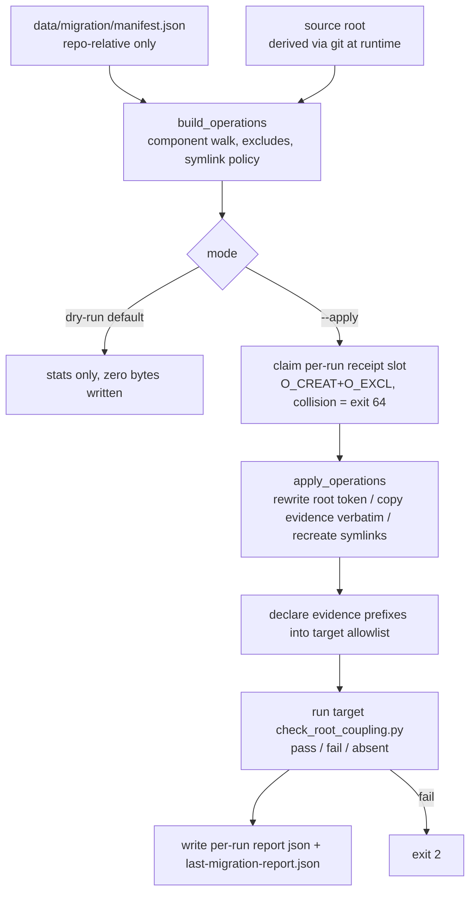

# Migration engine v2 — migrate_seed.py

`scripts/migrate/migrate_seed.py` is the S2 engine (ts-skill-bettor issue #4; commit 5473211) that moved four subtrees from the source repo into bettor-arena — see [migration history](history.md). It remains the standing mechanism for manifest-declared subtree migration.

## Contract

From the module docstring (src: scripts/migrate/migrate_seed.py:4-30):

- The manifest holds repo-relative paths ONLY; the single user-supplied absolute path is `--target-root`. The source root is derived at runtime via `git rev-parse --show-toplevel` of `--source-root` or of the engine's own tree.
- Same root, or target nested in source, refuses with exit 64 (src: migrate_seed.py:390-394).
- **Dry-run is the default and writes zero bytes anywhere**; `--apply` writes; `--stats` prints the JSON payload.
- Text files matching `rewrite_suffixes` get the source-root absolute string rewritten to the `{REPO_ROOT}` token; files under an `evidence_allowlist` prefix are copied VERBATIM ("rewriting evidence is forging evidence") and declared into the target's root-coupling allowlist instead.
- Exit codes: 0 ok · 2 post-apply target gate red · 64 usage/precondition · anything else is a crash.

## Manifest — the declarative surface

`data/migration/manifest.json` (`bettor-arena-migration@2.0.0`) declares the four components (agents-skills, claude-host with `.claude/skills/` excluded, kb-ingest, loop-factory), the rewrite suffix list, excluded path parts (`node_modules`, `__pycache__`, `.venv`, `dist`), and a ~40-entry evidence allowlist of port-lineage ledgers and historical-evidence files (src: data/migration/manifest.json). `.claude/skills` is excluded because "skill content lives host-neutral in .agents/skills; target-side symlinks are bootstrap's job (S5), not migration payload" (manifest notes). `load_manifest` validates every key, every component field, and repo-relativity of every path — rejecting absolute paths, `~`, home-root patterns, and upward traversal (src: migrate_seed.py:105-153).

## Operation planning and application

`build_operations` enumerates git-visible files per component (`ls-files -co --exclude-standard`), applies exclude prefixes and excluded parts, errors when a `required` component matches nothing, and refuses absolute symlinks in the payload ("absolute symlink in payload re-couples the target"); relative symlinks are recreated as-is (src: migrate_seed.py:167-231). `apply_operations` rewrites or copies, preserves the executable bit, and — load-bearing — after replacing the source root scans the rewritten text for any OTHER home-root pattern and raises on residue: "declare it as evidence or fix the source" (src: migrate_seed.py:234-268; made falsifiable by commit 760669b). The home patterns are assembled from fragments, the same self-exclusion trick as [check_root_coupling](../gates/structure-gates.md) (src: migrate_seed.py:52-55).

## Receipts — append-only history with an atomic claim

After `--apply`, a per-run stats receipt (no absolute paths — "the receipt lands inside the target tree and must never re-couple it to a machine", src: migrate_seed.py:289-291) is written to `<target>/data/migration/report-<source-commit-7>-<sorted-component-ids>.json`. History is never silently overwritten: the receipt slot is claimed with `os.open(O_CREAT|O_EXCL)` — atomically closing the TOCTOU window between an exists-probe and a write, so two racing applies cannot both win; a crash after the claim leaves an empty receipt that makes the next run refuse until `--force-receipt` acknowledges it — "failing closed on ambiguous history" (src: migrate_seed.py:407-436; commit 8fe5c12, issue #19). A collision without the flag is exit 64 with the exact path named. `last-migration-report.json` is written as a COPY of the latest run for existing readers (src: migrate_seed.py:443-450; commit 73fe3a5). This is the single explicit exception to receipt immutability recorded in the glossary (src: CONTEXT.md:11-13; commit 65eda5a).

`ensure_target_allowlist` then appends any undeclared evidence prefixes to the target's `scripts/gates/root_coupling_allowlist.txt` (only when the target carries the gate surface; src: migrate_seed.py:298-330), and `run_target_gate` reruns the target's own `check_root_coupling.py`, distinguishing `pass`/`fail`/`absent` — a red gate after apply is exit 2 (src: migrate_seed.py:333-346, 451-456).

## Selftest

`--selftest` builds throwaway git fixtures and proves EVERY exit path in the contract, including that dry-run leaves the target byte-identical (src: migrate_seed.py:28-30).

## Relationship to mcp/production/migrate.py

Different engine, different domain, same discipline: `mcp/production/migrate.py` migrates MCP configuration by profile with chained receipts and human gates ([MCP surface](../host-loop/mcp-surface.md)); this engine migrates repo subtrees by manifest. Neither reuses the other — the iron-law-7 rebuild-not-assume rule (src: ARCHITECTURE.md:55).
